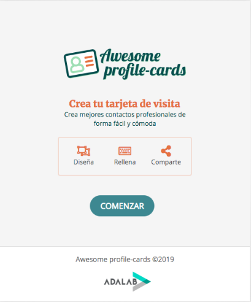

# Awesome profile-cards

- ¡Hola! Somos CardToGo, un grupo de cuatro mujeres que acaba de realizar su primer proyecto aplicando JS.

- Hemos creado una web que permite crear, modificar y compartir tarjetas de visita con diseños personalizados de forma fácil y en pocos clicks. Además, al ser en formato online, la elaboración de estas tarjetas tiene un reducido impacto sobre el medio ambiente.

## Cómo crear la tarjeta.

1. Accede a nuestra web a través de este link: http://beta.adalab.es/project-promo-h-module-2-team-1-morning/.

2. Una vez dentro clicka en el botón **COMENZAR**.

3. Selecciona la paleta de color que más te guste.

4. Rellena el formulario con tus datos y añade tu foto.

5. Llega el momento de compartir tu tarjeta. Clicka en el botón **CREAR TARJETA** y se generará una url para que puedas compartir tu tarjeta.

6. ¡Comparte tu tarjeta con el mundo a través de Twitter!

## Herramientas y tecnologías utilizadas.

- HTML
- Sass
- Java Script
- Gulp
- Git

- La web tiene diseño responsive por lo que se adapta a diferentes dispositivos.

### Versión desktop.

### Versión tablet.

### Versión móvil.

